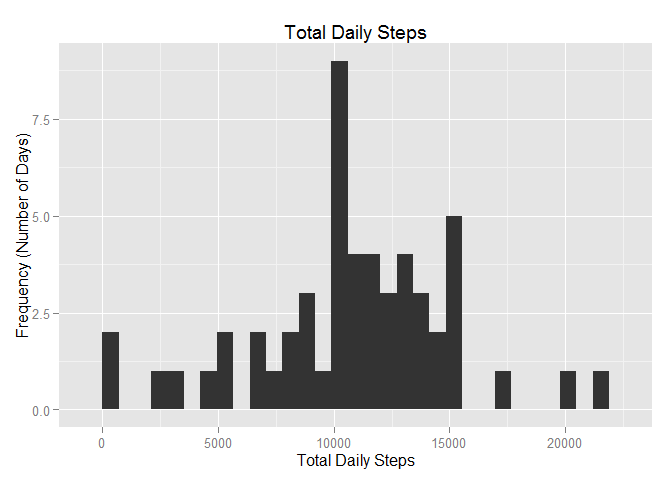
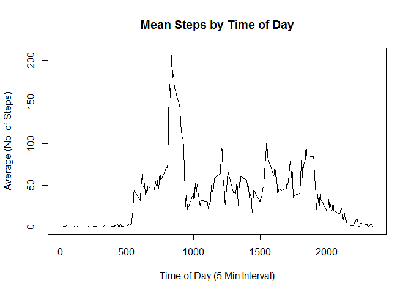
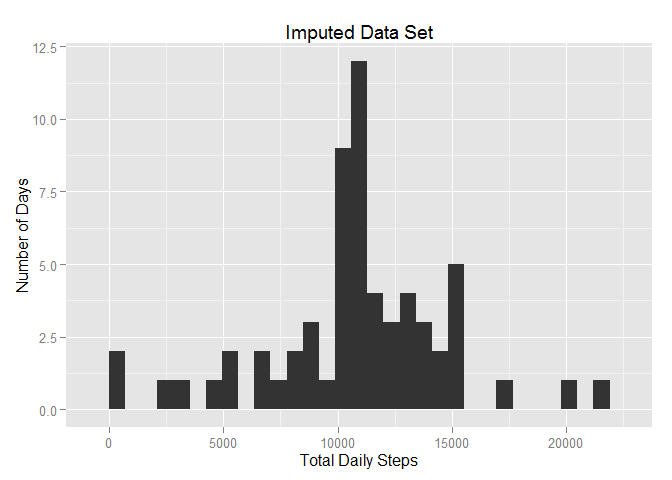
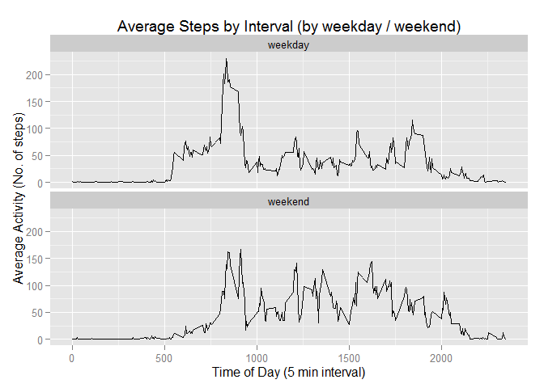

# Reproducible Research: Peer Assessment 1
## Introduction
This assignment makes use of data from a personal activity monitoring device. This device collects data at 5 minute intervals through out the day. The data consists of two months of data from an anonymous individual collected during the months of October and November, 2012 and include the number of steps taken in 5 minute intervals each day.

###Data

the data for this assignment Was manually downloaded from https://d396qusza40orc.cloudfront.net/repdata%2Fdata%2Factivity.zip on 5-Jun-15
and unzipped, resulting in the file activity.csv in the current working directory.

The variables included in this dataset are:

•steps: Number of steps taking in a 5-minute interval (missing values are coded as NA)

•date: The date on which the measurement was taken in YYYY-MM-DD format

•interval: Identifier for the 5-minute interval in which measurement was taken


The dataset is stored in a comma-separated-value (CSV) file and there are a total of 17,568 observations in this dataset.


## Loading and preprocessing the data
Step 1. Read the file into a data frame and convert the date to type 'date'


```r
## Loading and preprocessing the data
activity <- read.csv("activity.csv")
activity$date <- as.Date(activity$date)

str(activity)
```

```
## 'data.frame':	17568 obs. of  3 variables:
##  $ steps   : int  NA NA NA NA NA NA NA NA NA NA ...
##  $ date    : Date, format: "2012-10-01" "2012-10-01" ...
##  $ interval: int  0 5 10 15 20 25 30 35 40 45 ...
```

```r
head(activity)
```

```
##   steps       date interval
## 1    NA 2012-10-01        0
## 2    NA 2012-10-01        5
## 3    NA 2012-10-01       10
## 4    NA 2012-10-01       15
## 5    NA 2012-10-01       20
## 6    NA 2012-10-01       25
```

```r
summary(activity)
```

```
##      steps             date               interval     
##  Min.   :  0.00   Min.   :2012-10-01   Min.   :   0.0  
##  1st Qu.:  0.00   1st Qu.:2012-10-16   1st Qu.: 588.8  
##  Median :  0.00   Median :2012-10-31   Median :1177.5  
##  Mean   : 37.38   Mean   :2012-10-31   Mean   :1177.5  
##  3rd Qu.: 12.00   3rd Qu.:2012-11-15   3rd Qu.:1766.2  
##  Max.   :806.00   Max.   :2012-11-30   Max.   :2355.0  
##  NA's   :2304
```


## What is mean total number of steps taken per day?

Step 2. Calculate the total number of steps taken per day

```r
date_totals <- aggregate(activity$steps, list(activity$date), sum)
colnames(date_totals) <- c("date", "steps")
head(date_totals)
```

```
##         date steps
## 1 2012-10-01    NA
## 2 2012-10-02   126
## 3 2012-10-03 11352
## 4 2012-10-04 12116
## 5 2012-10-05 13294
## 6 2012-10-06 15420
```

Step 3. Make a histogram of the total number of steps taken each day

```r
library(ggplot2)
qplot(date_totals$steps, geom="histogram", main="Total Daily Steps", xlab = "Total Daily Steps", ylab = "Frequency (Number of Days)", binwidth=706.46)
```

 

```r
date_mean <- mean(date_totals$steps, na.rm=TRUE)
date_mean
```

```
## [1] 10766.19
```

```r
date_median <- median(date_totals$steps, na.rm=TRUE)
date_median
```

```
## [1] 10765
```


## What is the average daily activity pattern?
Step 4. Calculate the mean steps for each 5-minute interval

```r
interval_avg <- aggregate(activity$steps, by=list(activity$interval), FUN=mean, na.rm=TRUE)
colnames(interval_avg) <- c("interval", "avgsteps")
head(interval_avg)
```

```
##   interval  avgsteps
## 1        0 1.7169811
## 2        5 0.3396226
## 3       10 0.1320755
## 4       15 0.1509434
## 5       20 0.0754717
## 6       25 2.0943396
```

Step 5. Make a time series plot (i.e. type = "l") of the 5-minute interval (x-axis) and the average number of steps taken, averaged across all days (y-axis)

```r
plot(interval_avg$interval, interval_avg$avgsteps, type='l', xlab="Time of Day (5 Min Interval)", ylab="Average (No. of Steps)", main="Mean Steps by Time of Day")
```

 

Step 6. Which 5-minute interval, on average across all the days in the dataset, contains the maximum number of steps?

```r
interval_avg[which.max(interval_avg$avgsteps),1]
```

```
## [1] 835
```


## Imputing missing values
Step 7. Calculate the total number of missing values in the dataset (i.e. the total number of rows with NAs)

```r
sum(is.na(activity))
```

```
## [1] 2304
```

Step 8. Create a new data set and replace the missing values with the average numbers of steps across all days for that interval 

```r
activity2 <- activity
missing_values <- sapply(activity2$interval[!complete.cases(activity2)], 
                         function(x){interval_avg$avgsteps[interval_avg$interval==x]})
activity2$steps[!complete.cases(activity2)] <- missing_values
        
str(activity2)
```

```
## 'data.frame':	17568 obs. of  3 variables:
##  $ steps   : num  1.717 0.3396 0.1321 0.1509 0.0755 ...
##  $ date    : Date, format: "2012-10-01" "2012-10-01" ...
##  $ interval: int  0 5 10 15 20 25 30 35 40 45 ...
```

```r
head(activity2)
```

```
##       steps       date interval
## 1 1.7169811 2012-10-01        0
## 2 0.3396226 2012-10-01        5
## 3 0.1320755 2012-10-01       10
## 4 0.1509434 2012-10-01       15
## 5 0.0754717 2012-10-01       20
## 6 2.0943396 2012-10-01       25
```

```r
summary(activity2)
```

```
##      steps             date               interval     
##  Min.   :  0.00   Min.   :2012-10-01   Min.   :   0.0  
##  1st Qu.:  0.00   1st Qu.:2012-10-16   1st Qu.: 588.8  
##  Median :  0.00   Median :2012-10-31   Median :1177.5  
##  Mean   : 37.38   Mean   :2012-10-31   Mean   :1177.5  
##  3rd Qu.: 27.00   3rd Qu.:2012-11-15   3rd Qu.:1766.2  
##  Max.   :806.00   Max.   :2012-11-30   Max.   :2355.0
```

```r
sum(is.na(activity2))
```

```
## [1] 0
```

Step 9.   Calculate the total number of steps taken per day

```r
date_totals2 <- aggregate(activity2$steps, list(activity2$date), sum)
colnames(date_totals2) <- c("date", "steps")
head(date_totals2)
```

```
##         date    steps
## 1 2012-10-01 10766.19
## 2 2012-10-02   126.00
## 3 2012-10-03 11352.00
## 4 2012-10-04 12116.00
## 5 2012-10-05 13294.00
## 6 2012-10-06 15420.00
```

Step 10.  Make a histogram of the total number of steps taken each day

```r
par(mfrow=c(1, 2))
qplot(date_totals2$steps, geom="histogram", main = "Imputed Data Set", xlab = "Total Daily Steps", ylab = "Number of Days", binwidth = 706.46)
```

 

Step 11. Calculate and report the mean and median of the total number of steps taken per day

```r
date_mean2 <- mean(date_totals2$steps, na.rm=TRUE)
date_mean2
```

```
## [1] 10766.19
```

```r
date_median2 <- median(date_totals2$steps, na.rm=TRUE)
date_median2
```

```
## [1] 10766.19
```


The original mean value was 1.0766189\times 10^{4} while the updated value is also 1.0766189\times 10^{4}. The mean value has not been effected by the imputing of values.  

The original median value was 10765 while the updated value is now 1.0766189\times 10^{4}. The median value has been effected by the imputing of values.  

The total number of steps has changed by  -8.6129509\times 10^{4} across all days. 


## Are there differences in activity patterns between weekdays and weekends?
Step 12. Create a new factor variable in the dataset with two levels – “weekday” and “weekend” indicating whether a given date is a weekday or weekend day.

```r
activity2 <- cbind(activity2, weekday = weekdays(activity2$date))
activity2$weekday <- sapply(activity2$weekday, function(x) {
        if (x %in% c("Saturday", "Sunday")) {
                "weekend"} 
        else {
                "weekday"}
        })
```


Step 13. Make a panel plot containing a time series plot (i.e. type = "l") of the 5-minute interval (x-axis) and the average number of st

```r
sp <- ggplot(aggregate(steps ~ interval + weekday, data=activity2, FUN=mean), aes(x=interval, y=steps)) + 
        geom_line() +
        facet_wrap(~ weekday, ncol=1) + 
        xlab("Time of Day (5 min interval)") + 
        ylab("Average Activity (No. of steps)") + 
        ggtitle("Average Steps by Interval (by weekday / weekend)")

sp
```

 

Some observations can be made, based on this comparison. 
a. moderate activity appears to begin slightly earlier on weekdays, as evidenced by the 50-step plateau beginning around interval 500.
b. peak acivity occurs during weekday mornings (around interval 800)
c. the general level of activity seems to be slightly higher on weekends
d. activity seems to end slightly earlier on weekdays
